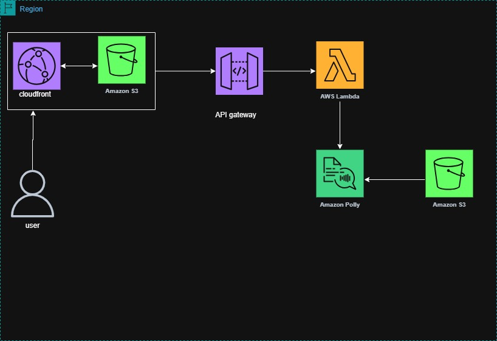

# Audio summarizer
A serverless web application that converts user text (typed ) into **natural-sounding speech** using **Amazon Polly**. The app is built with **AWS Cloud Services**, provisioned using **Terraform**, and includes a static frontend hosted on **S3 + CloudFront** for secure HTTPS access.  

## Prerequisites
- AWS CLI v2 configured (`aws configure`).  
- Terraform v1.5+.  
- Python 3.11.  
- `zip` utility (Linux/macOS) or PowerShell `Compress-Archive` (Windows).  
- AWS IAM user/role with permissions for Lambda, S3, Polly, API Gateway, CloudFront, and ACM.
  
## Features
- Convert typed text into speech.  
- Supports multiple Polly voices and formats (MP3, OGG).  
- Allow users to input text for conversion.  
- Audio files stored in Amazon S3 auto-expire after a set period(30 days).  
- Play audio directly in the browser or download as a file.  
- Scalable and cost-efficient (pay-per-use with serverless).  
- HTTPS frontend served via CloudFront.  

## Architecture


##  Project Structure

tts-project/  
├── terraform/              # Infrastructure as Code  
│   ├── main.tf  
│   ├── variables.tf  
│   ├── outputs.tf  
│   └── terraform.tfvars  
├── lambda/                 # Backend (AWS Lambda)  
│   └── lambda_function.py  
├── frontend/               # Static frontend  
│   ├── index.html  
│   └── styles.css  
└── README.md 


## Setup & Deployment

1. **Clone the repo**
   ```bash
   git clone https://github.com/your-username/serverless-tts.git
   cd serverless-tts/terraform
   ```

2. **Configure Terraform variables**
   Edit `terraform.tfvars`:
   ```hcl
   frontend_bucket_name = "tts-frontend-YOURNAME123"
   audio_bucket_name    = "tts-audio-YOURNAME123"
   aws_region           = "us-east-1"
   prefix               = "tts"
   ```

3. **Package the Lambda**
   ```bash
   cd ../lambda
   zip -r ../lambda/create_post.zip lambda_function.py
   cd ..
   ```

4. **Deploy infrastructure**
   ```bash
   cd terraform
   terraform init
   terraform apply -auto-approve
   ```

5. **Update frontend with API endpoint**
   ```bash
   terraform output -raw api_endpoint
   ```
   Replace `REPLACE_WITH_API_ENDPOINT` in `frontend/index.html`.

6. **Upload frontend to S3**
   ```bash
   aws s3 sync ../frontend/ s3://tts-frontend-YOURNAME123
   ```

7. **Get CloudFront domain**
   ```bash
   terraform output -raw cloudfront_domain_name
   ```
   Open this HTTPS URL in your browser.


##  Usage
1. Open your CloudFront URL in browser.  
2. Enter text.  
3. Select a voice and format, then click **Convert to Speech**.  
4. Play the audio or download it.  
 

## Security
- CORS restricted to CloudFront domain.  
- IAM least privilege principle.  
- Private S3 buckets with presigned URLs.  
- HTTPS via CloudFront.  
- Lifecycle rules auto-delete audio after expiry.  


## Cost Optimization
- Polly: pay per million characters.  
- Lambda: pay per execution.  
- S3: lifecycle rules auto-delete audio.  
- CloudFront: pay for data transfer (use compression & caching).  


##  Troubleshooting
- **“Network error: Failed to fetch”** → Fix CORS or mixed content.  
- **403 Forbidden** → Check CloudFront OAI permissions.  
- **No audio** → Verify API endpoint in `index.html` and test API manually.  


## Future Improvements
- Add Cognito authentication.  
- Support batch conversion with Step Functions.  
- User library of audio files.  
- Progress indicators for long conversions.  


## License
MIT License © 2025 Florence Nabengye  
